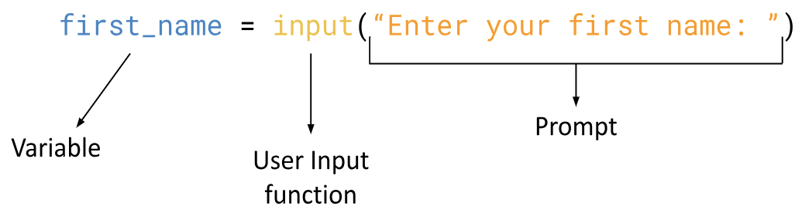

# 3.3 User Input

## Success Criteria
- [x] I can use the input() function to get user input
- [x] I can change different data types into an int, float, and str

## Terminology
>`Programmer`: The person writing the code<br>
>`User`: The person running and interacting with the code

## User Input
So far, all of the examples and homework questions we've done, interact with the user in a one-way fashion. Meaning, you write a program, you run it, it prints something and that's it.

Sometimes, we want the specific information from the user. This is called `user input`.
We need two things when using user input:
1. A way to **retrieve** the information the user types
2. A way to **store** the information

### input()
---
The input() function is a function that prints a prompt and retrieves text from the user.



```General Form:```


<span style="color:red">
<b>
NOTE: The prompt MUST be a <i>string</i>
</b>
</span>

<br>

<ins>```EXAMPLE #1:```</ins>``` Explore this example by typing the following into Lesson.py```
```python
first_name = input("Enter your first name: ")

print("Your first name is", first_name)
```

<ins>```EXAMPLE #2:```</ins>``` What data type is first_name from example #1?```
```python
print(type(first_name))
```

<ins>```EXAMPLE #3:```</ins>``` What about if the user enters a number? What is the data type?```
```python
age = input("Age: ")

print("Your age is", age)
print(type(age))
```
<span style="color:red">
<b>
NOTE: Anything the user types will ALWAYS be a <i>string</i>
</b>
</span>

### Type Conversion - Casting
---
There may be times when you want a variable to be of a specific type. This can be done using **`casting`**

There are three functions we can use to cast:
| Casting Function | Description | Example | Output |
| ---------------- | ----------- | ------- | ------ |
| `int(<float>)` | Changes a float to an int by removing all decimals | `int(1.23)` | `1` |
|                |                                                    | `int(12.8)` | `12` |
| `int(<str>)`   | Changes a string to an int (as long as the string is a whole number) | `int("10")`  | `10`      |
|                |                                                                      | `int("ten")` | `ERROR` |
| `float(<int>)` | Changes an int to a float by adding `.0`                        | `float(1)`       | `1.0`   |
| `float(<str>)` | Changes a string to a float (as long as the string is a number) | `float("1")`     | `1.0`   |
|                |                                                                 | `float("2.334")` | `2.334` |
| `str(<int>)`   | Changes an int to a string  | `str(12)`   | `"12"`   |
| `str(<float>)` | Changes a float to a string | `str(12.3)` | `"12.3"` |
<br>

<ins>```EXAMPLE #4:```</ins>``` Let's change the user input from Example #3 from a string to an int```
```python
# Without casting
age = input("Age: ")
print(type(age)) # type is a str

# With casting
age = int(input("Age: "))
print(type(age)) # type is now an int
```

